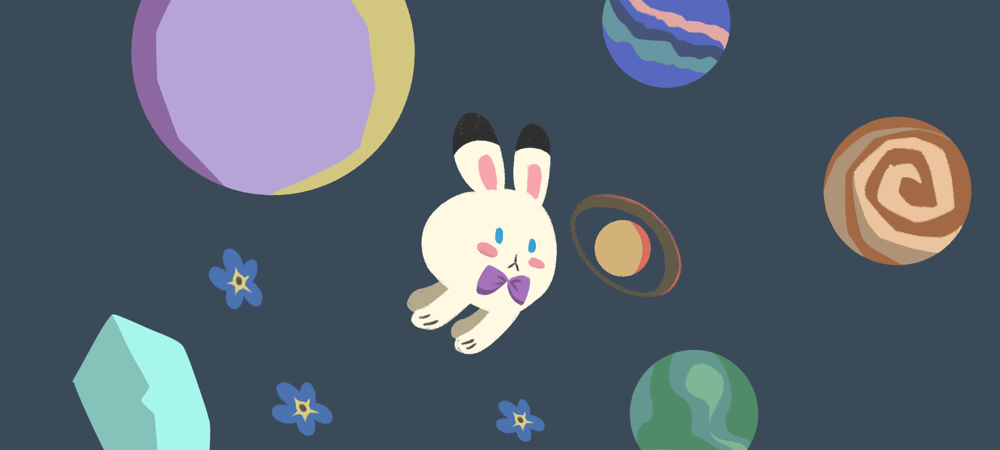
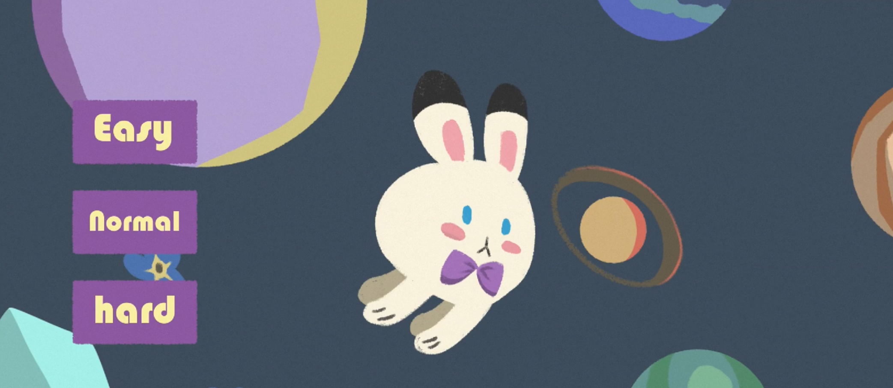
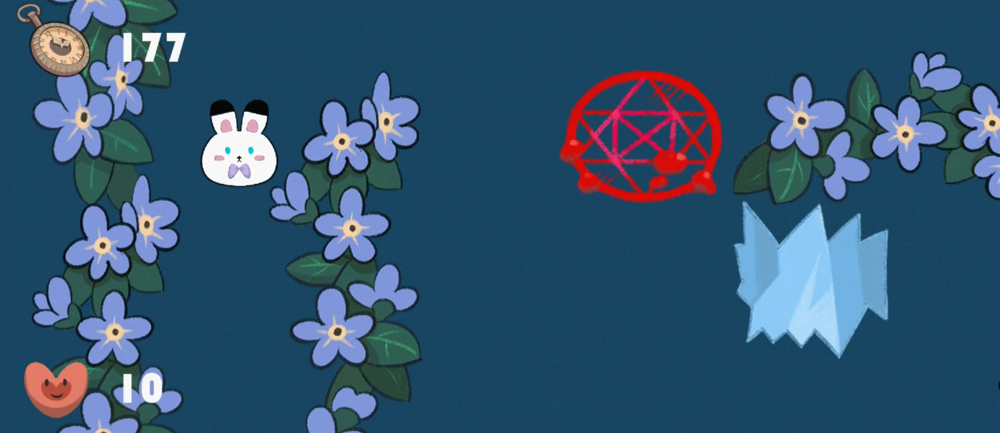
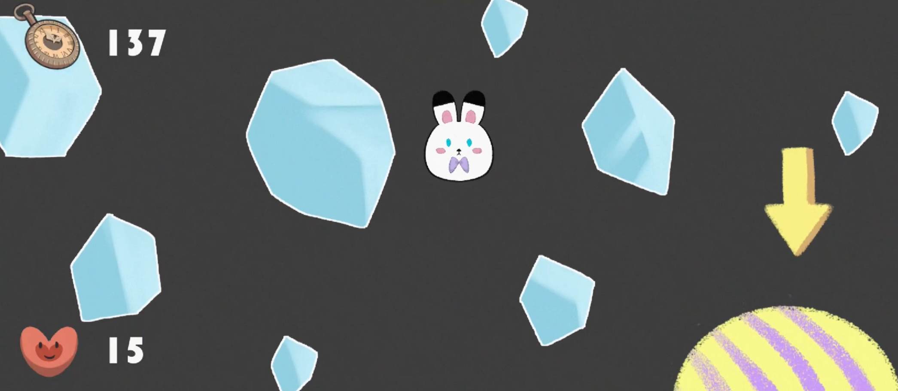
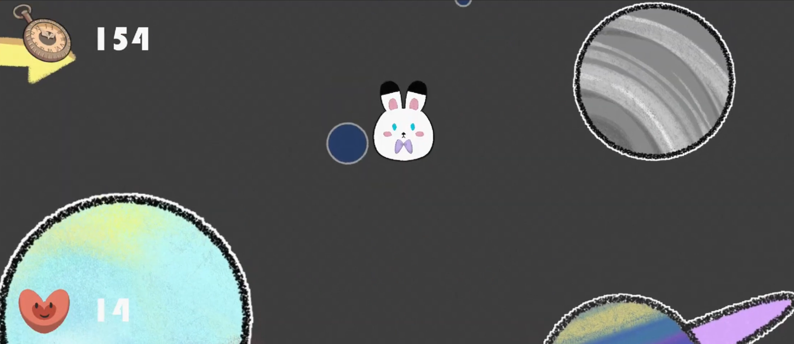
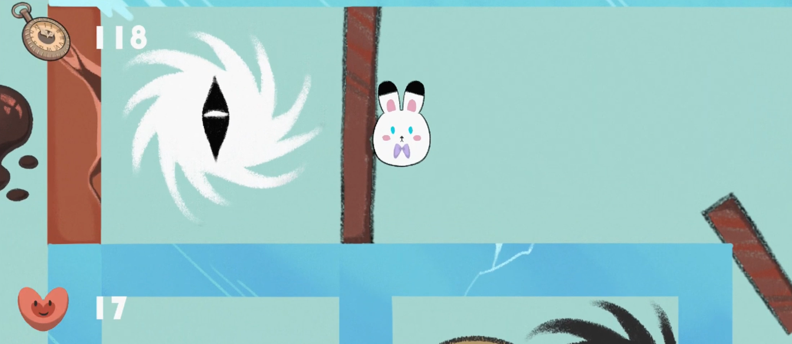
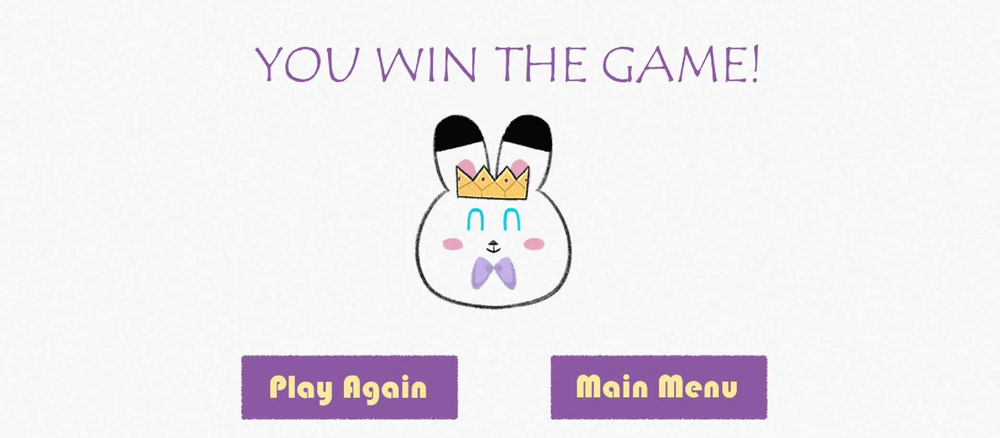

# Bunbun in Maze

Bunbun in Maze is a mobile game that allows players to control a little rabbit in interesting but also dangerous mazes. By tilting and shaking the mobile phone, this rabbit can move freely, break through the wood obstacles, or save itself from frozen ice. 

## Gameplay Video
Watch the gameplay video here:
[Game Demonstration](https://drive.google.com/file/d/1FxF2hRYlblyYDrEB0aRLuJddEH0PE3w4/view?usp=drive_link)

## Engine and Platform
This game is developed using the **Godot 4** game engine.

Currently, *Bunbun in Maze* has only been tested on **Android mobile devices**, and therefore it is only supported on Android at this stage. The gameplay relies on mobile motion sensors, so it is not designed for desktop platforms.

## Download

The latest version of the game can be downloaded from: 
[Download game](https://drive.google.com/drive/folders/1NM9Iqh6MTPgyG_mZd8fJzBfdY8pwRpx_?dmr=1&ec=wgc-drive-globalnav-goto)

## How to Play

- Tilt the phone to move Bunbun around the maze  
- Shake the phone to break wooden obstacles  
- Shake the phone repeatedly to escape from ice  
- Avoid hazards (suspicious red stars, magic cirles, mud, some planets) to preserve health  
- Reach the exit gate to proceed to the next maze

## Source code 
It's in the folder "icecream-1", not "bunbun1".

## Game Screenshots

